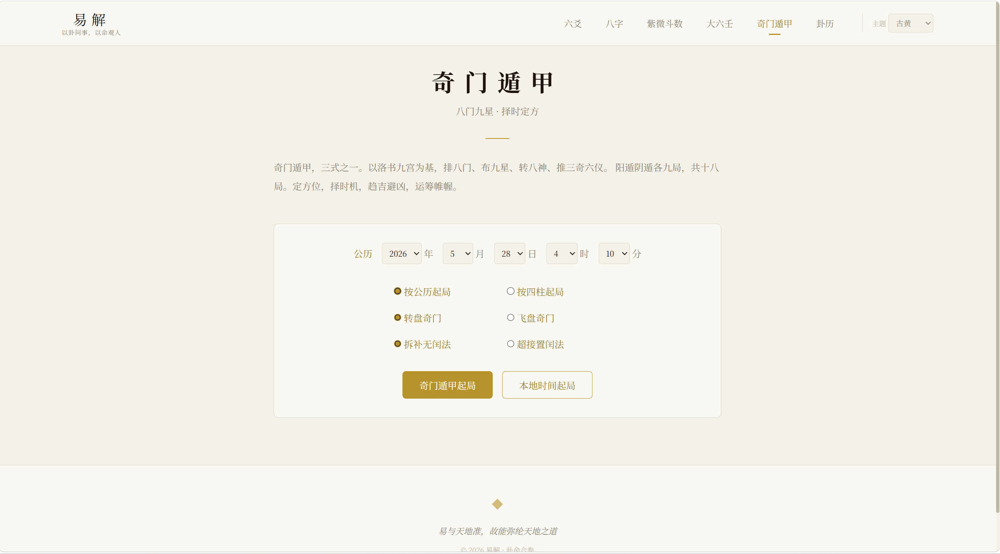
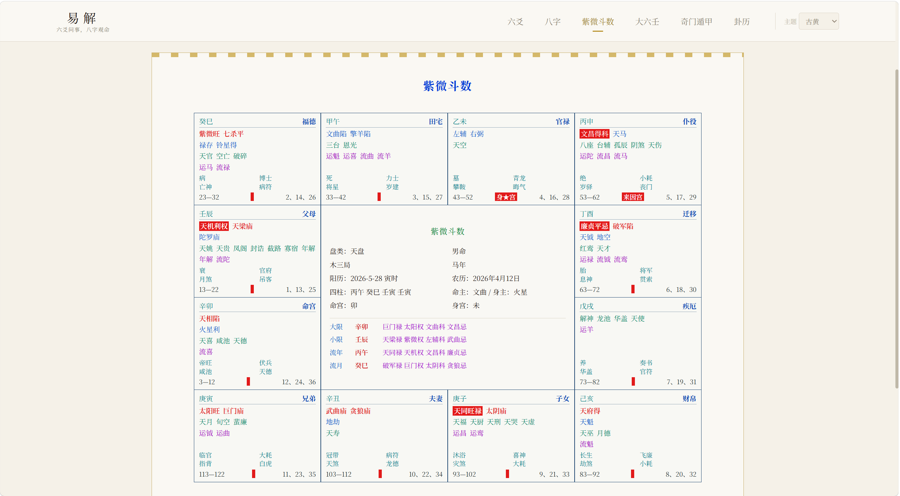
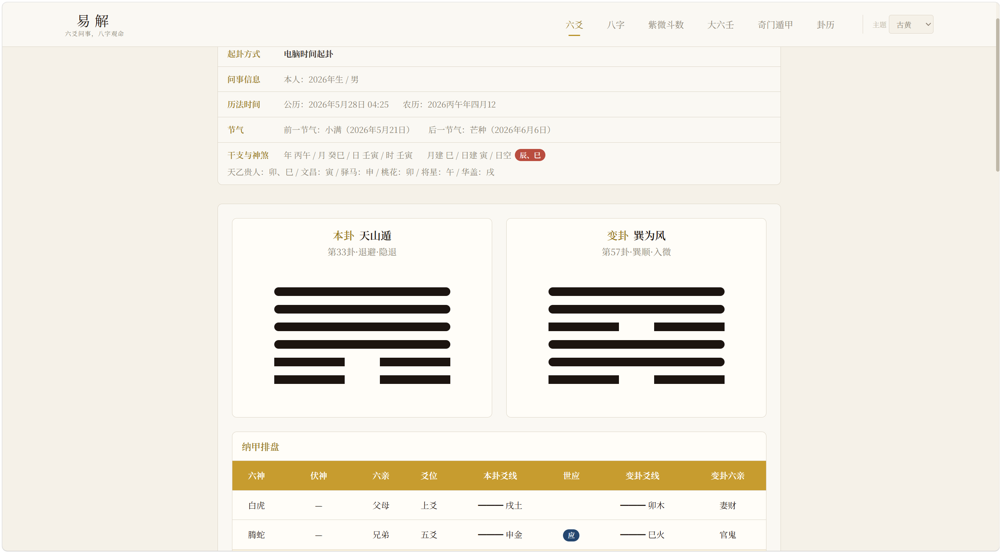
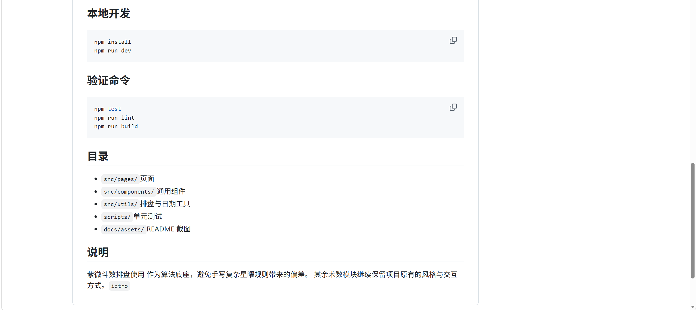

# 易解

易解是一套面向中国术数的前端排盘站点，覆盖六爻、八字、大六壬、奇门遁甲与紫微斗数。项目采用 React + Vite 构建，目标是做能直接使用、也能继续扩展的排盘工具。

在线地址：<https://yijing-pi.vercel.app>

## 主要内容

- 六爻起卦与卦例阅读
- 八字排盘与四柱命理
- 大六壬排盘
- 奇门遁甲排盘
- 紫微斗数在线排盘
- 主题切换与历史记录

## 页面效果

  
  
  
  
  
  

